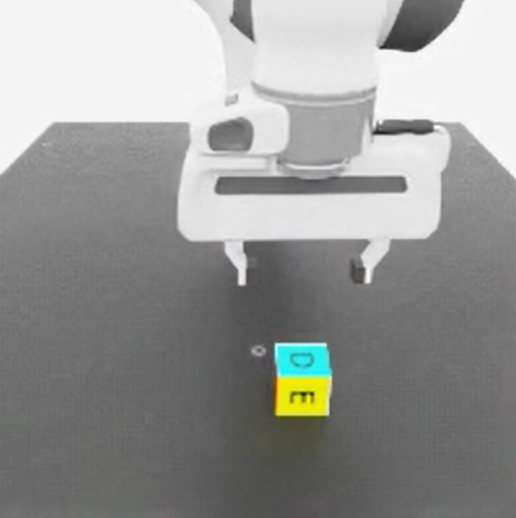
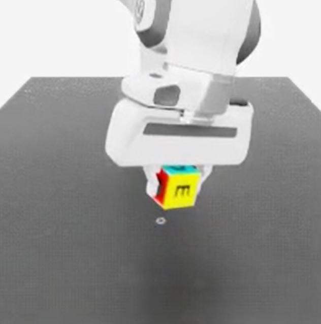

# Isaac Lab：画像と言語でcubeを操作するVLA

**同じモデルで「cubeの上へ移動」と「cubeを持ち上げる」を実行 **
<table>
  <tr>
    <td align="center">
      
       <b> above </b>
    </td>
    <td align="center">
      
       <b> pick </b>
    </td>
  </tr>
</table>

[English](README_ENG.md) · [実装](document/README_JPN.md#2-方法とモデル構成) · [再現手順](document/README_JPN.md#6-再現と確認の順序) · [検証記録](result/evidence/README.md)

## デモ動画

- [`above_trimmed.mp4`](result/evidence/videos/above_trimmed.mp4)：above 動画
- [`pick_trimmed.mp4`](result/evidence/videos/pick_trimmed.mp4)：pick 動画

実時間50fps。末尾のみカットし、静止画追加・倍速・動作の差し替えはしていません。

## 結果（2026年9月18日）

| 指示 | 結果 | 判定基準 | ステップ数 |
|---|---|---|---:|
| `move above the cube` | 最終位置誤差20.887 mm、50ステップ保持 | 30 mm以内を50ステップ | 424 |
| `pick up the cube` | 最終cube高さ124.960 mm、横移動最大31.025 mm | 高さ121.000 mm以上を10ステップ、横移動50 mm以内 | 879 |

両タスクとも別実行で、行動・手先位置/姿勢・cube位置・指位置の全7配列が完全一致。録画時も検証軌道と一致しました。高さはワールド座標で、持ち上げ量そのものではありません。

## 仕組み

入力は卓上・手首カメラの画像、ロボット状態、言語指示、進行度。共通の基礎モデルに、学習した視覚補正・開閉補正・XY減衰を組み合わせます。2タスクで同じ構成を使い、実行中の教師介入やステップ番号による強制切り替えはありません。進行度が入力に含まれるため、純粋な物理状態理解を実証したとは扱いません。

## 確認範囲

固定初期状態・2つの指示に対する結果です。接触力の検証や未知配置・言い換えへの汎化は今後の課題です。以前の言語ペア8/8は開発途中の結果で、今回の最終構成の再検証結果ではありません。

成功後も3秒間推論した映像では、aboveの位置ずれとpickの落下が発生しました。掲載用動画はその前で終了します。長時間の安定保持まで達成したとは記載しません。

## フォルダ

- `code/`：モデル・推論・学習・評価・動画処理
- `datasets/`：元データの画像例、データ構成
- `result/`：モデルの識別情報、検証記録、動画
- `document/`：方法、環境、再現手順、更新履歴
- `history/`：履歴管理用フォルダ。元プロジェクト：[isaac-lab-vla-cube-lift_1](history/isaac-lab-vla-cube-lift_1)。

## 備考

大容量データセット（two_instruction.hdf5）および学習済みモデル（shared_full_candidate.pt）をバックアップ用ディレクトリ（isaac-lab-vla-cube-lift_bk_data_and_model）へ移動・退避。
