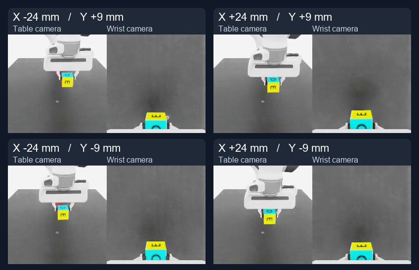

# Isaac Lab：言語指示と画像でCubeをつかんで持ち上げる

確認済み動画から切り出した、四象限での持ち上げ・保持の様子です。各枠は左がテーブル、右が手首カメラです。

[English](README_ENG.md)

**「pick up the cube」という指示とカメラ画像から、FrankaがCubeをつかみ、持ち上げて3秒間保持します。**

テーブルと手首のカメラ画像、ロボット状態、言語指示を入力し、学習モデルが腕とグリッパーの動作を出力するVLAです。対象はIsaac Lab上のシミュレーションです。

モデルの重みは未公開です。 本リポジトリは実装・評価記録・動画を公開しています。推論には別途チェックポイントが必要なため、公開ファイルだけでは実行できません。

## 動画

同じモデルによる四象限の動画です。各動画は左がテーブル、右が手首カメラ。実時間50fpsで、4本ともpick・3秒保持に合格し、目視確認済みです。録画試行は下記の評価件数に加算していません。

| X−24, Y＋9 mm | X＋24, Y＋9 mm |
|---|---|
| [▶ X−24 / Y＋9](result/evidence/videos/x-24_y9.mp4) | [▶ X＋24 / Y＋9](result/evidence/videos/x24_y9.mp4) |
| **X−24, Y−9 mm** | **X＋24, Y−9 mm** |
| [▶ X−24 / Y−9](result/evidence/videos/x-24_y-9.mp4) | [▶ X＋24 / Y−9](result/evidence/videos/x24_y-9.mp4) |

## どこまでできたか

| 評価 | 結果 |
|---|---:|
| 開発中に確認してきた29地点 | 29/29成功 |
| モデルを固定して初めて試した8地点 | 7/8成功 |

Cubeの位置は基準位置からX・Y各±30mmの範囲で変更しました。追加8地点は四象限に2地点ずつ配置しました。各地点1試行で、範囲全体の成功率を保証するものではありません。

追加評価の `(11, −23)mm` では接近位置がずれ、持ち上げに失敗しました。成功例とともに失敗例も記録しています。その後の改良実験とは区別し、この公開版は追加評価時のモデルを固定しています。

## 言語・画像・動作

- **言語：** データの指示は `pick up the cube`。推論時もトークン化して言語エンコーダへ入力します。
- **画像：** テーブル・手首カメラのRGB画像を使用します。
- **動作：** 画像・言語・ロボット状態を統合し、GRUが過去の情報を保持して7次元の動作を出力します。

実行時に教師が動作を上書きする処理は使いません。Cubeの正解位置は評価や教師データ収集に使用し、ポリシーへの入力には含めません。

学習・評価は単一指示です。異なる言語指示の意味に応じた動作の切り替えは未検証です。

## 資料

- [構成と判定条件](document/README_JPN.md)
- [全37地点の評価記録](result/evidence/README_JPN.md)
- [モデル](result/models/README_JPN.md)
- [データセット](datasets/README_JPN.md)
- [コードと再現準備状況](code/README_JPN.md)

## 現時点の制約

固定した初期状態・カメラ・シミュレーション環境での結果です。実機、照明や物体形状の変更、一般的な成功確率は検証していません。把持は持上げと保持による判定で、接触力の検証ではありません。

以前の画像位置推定＋段階制御による35地点成功の結果は、このVLAモデルの成績に含めません。

## 今後の課題

同じモデルで、設定した全評価地点のpick・3秒保持に成功する「完全成功」を目指します。未成功地点を改善しながら、成功済み地点の性能も維持することが課題です。

さらに、繰り返し試行と新しい位置での評価を通じて、偶然の成功に頼らず安定して動作できる範囲を広げます。全評価地点で成功した場合も、それだけで範囲内の任意の位置での成功を保証するとは扱いません。
