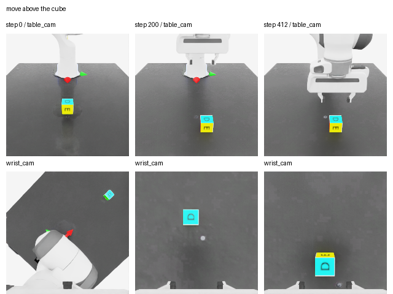
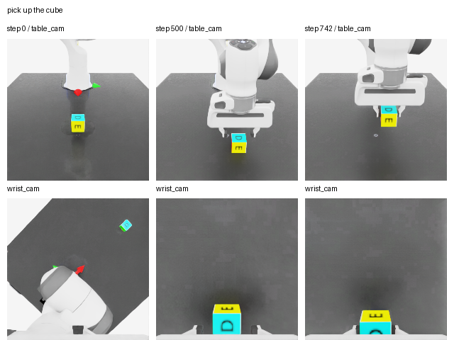

# Datasets (English)

[日本語](README_JPN.md) · [Source paths, hashes, and dependencies](dependency_manifest.json)

## Included Files

This collection includes the teacher HDF5, two visual observation files, gripper-retention and XY-intervention inputs, teacher hold data, three preservation-anchor files, language-pair targets, and verification/training JSON. Files with repeated names have descriptive destination names. Original experiment files are unchanged. The consumers field in the dependency manifest identifies the training script that reads each file. Some JSON files contain supervision or required verification metadata, not merely logs.

| File (relative to datasets/) | Contents | Used by |
|---|---|---|
| `demonstrations/two_instruction.hdf5` | teacher demonstrations | train_current_hold_adapter |
| `visual_consistency/base_observations13.npz` | reference visual observations | train_visual_consistency13 |
| `visual_consistency/tenth_observations13.npz` | perturbed visual observations | train_visual_consistency13 |
| `retention/retention_inputs700.npz` | 700 observations; 86 closure targets | train_retention_gripper |
| `xy_attenuation/xy_correction_inputs879.npz` | 879 observations; 79 intervention targets | train_xy_attenuation |
| `hold/settle_then_close623.npz` | 60 teacher settle/close observations | train_current_hold_adapter |
| `anchors/above442.npz` | 442 above preservation observations | train_current_hold_adapter, train_visual_consistency13, train_retention_gripper, train_xy_attenuation |
| `anchors/base_pick623.npz` | 623 base-policy approach observations | train_current_hold_adapter |
| `anchors/adapter_pick526.npz` | 526 adapter-policy approach observations | train_visual_consistency13 |
| `language/teacher_pairs.json` | 24 language-pair target records | train_current_hold_adapter |
| `metadata/base_training_protocol.json` | protocol read by training script | train_current_hold_adapter |
| `metadata/hold_collection.json` | teacher collection verification | train_current_hold_adapter |
| `metadata/above_anchor_collection.json` | anchor collection verification | train_current_hold_adapter |
| `metadata/base_pick_anchor_collection.json` | anchor collection verification | train_current_hold_adapter |
| `metadata/adapter_pick_anchor_collection.json` | anchor provenance | train_visual_consistency13 |
| `metadata/current_hold_training.json` | intermediate training report | train_current_hold_adapter |
| `metadata/visual_training.json` | report and anchor hashes read by final loader | shared_loader |

## Teacher Dataset

`demonstrations/two_instruction.hdf5` contains demo_1: move above the cube (413 samples), and demo_0: pick up the cube (743 samples). Instructions are stored in each demo's language_instruction attribute. Samples include two 200×200 RGB images, end-effector position, xyzw orientation, finger positions, and seven action components. Observations precede actions. Policy inputs add progress step/1200.

[Extracted instructions, shapes, and action examples](samples/examples.json). These images are teacher examples, not final-policy evaluation videos.

## Weights and Reproduction Scope

The intermediate adapter is stored separately at `../result/model/development/current_hold_adapter.pt`. The four final artifacts remain under result/model.

This organizes direct data dependencies of the four shipped training scripts and the intermediate weight. It does not include every historical training input needed to build the base checkpoint from scratch. The Isaac Lab environment and external wrappers are still required. Existing scripts retain their original Pod paths; importing data does not automatically redirect those scripts.

The 13 observation pairs, 86 closure targets, and 79 XY-intervention targets reuse development trajectories. They are not independent generalization tests or evidence of autonomous success. Intervention collection is distinct from final autonomous evaluation.

Public dataset hosting is not configured. Existing Git exclusions for large data and weights are retained.
